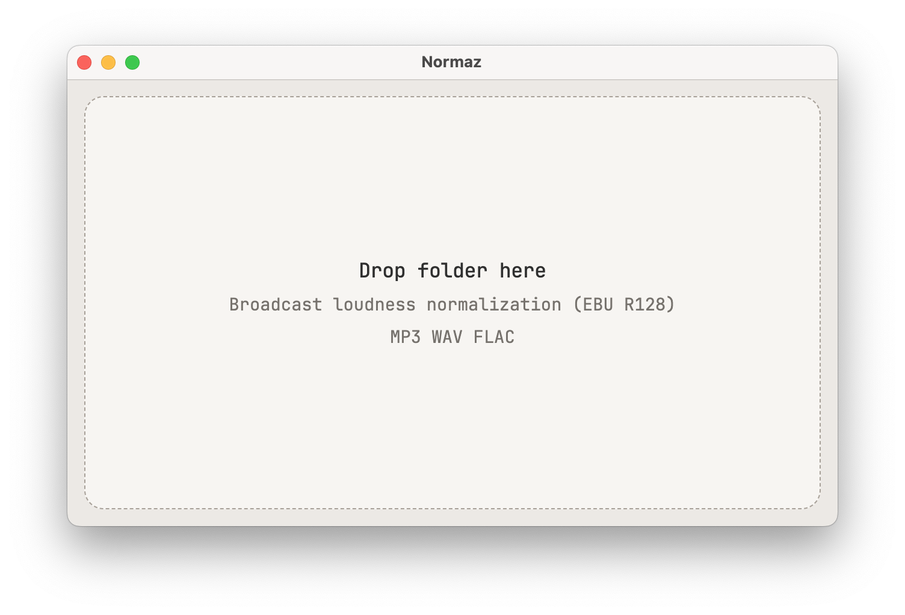
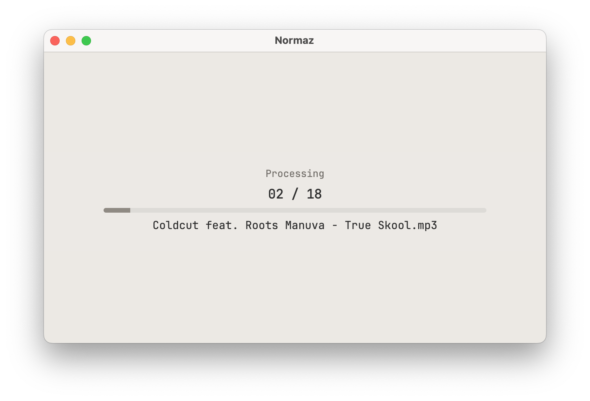
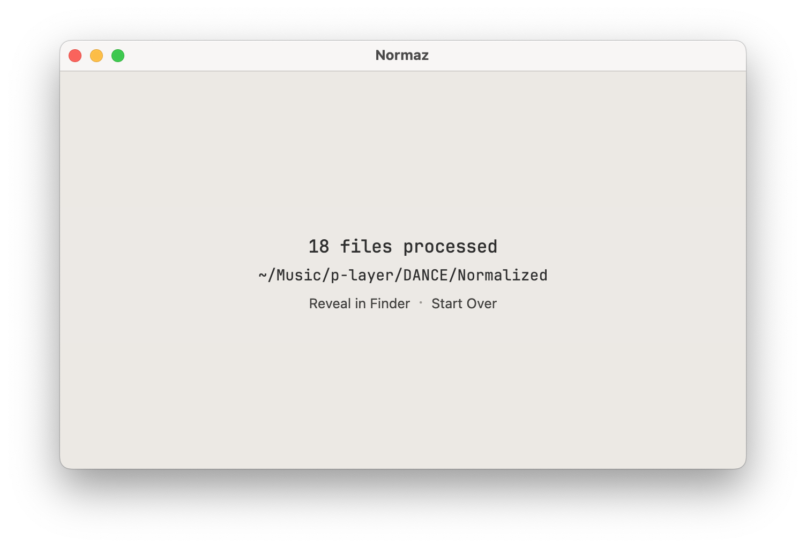

# Normaz

Normaz is a lightweight macOS utility for batch audio normalization designed for broadcasters, online radio stations, and music library preparation for on-air playback.

It creates normalized copies of audio files inside a separate Normalized folder while keeping the original files untouched.

---

## Features

- EBU R128 loudness normalization
- More consistent playback loudness between tracks
- Re-encoding to stable output audio files
- Cleanup of problematic variable bitrate MP3 files
- Creates normalized copies inside a separate Normalized folder
- Simple drag-and-drop workflow
- Local processing — no cloud services

---

## Supported Formats

- MP3
- WAV
- FLAC

---

## How It Works

1. Launch Normaz
2. Drag a folder with audio files into the window
3. Normaz scans supported files recursively
4. Normalized copies are written into:

text YourFolder/Normalized 

Original files are never modified.

---

## Why Normaz

Large music libraries often contain inconsistent loudness levels, unstable MP3 encodes, and problematic variable bitrate files.

Normaz helps create a cleaner and more predictable audio library for:
- radio automation systems
- playout software
- streaming preparation
- music archive cleanup

---

## macOS

Normaz is currently available for:
- Apple Silicon
- Intel Mac

Unsigned builds may require:
- right click → Open
during first launch on macOS Gatekeeper.

---

## Website

Broadcast tools for macOS:

p-layer.app

---

## License

Freeware.
